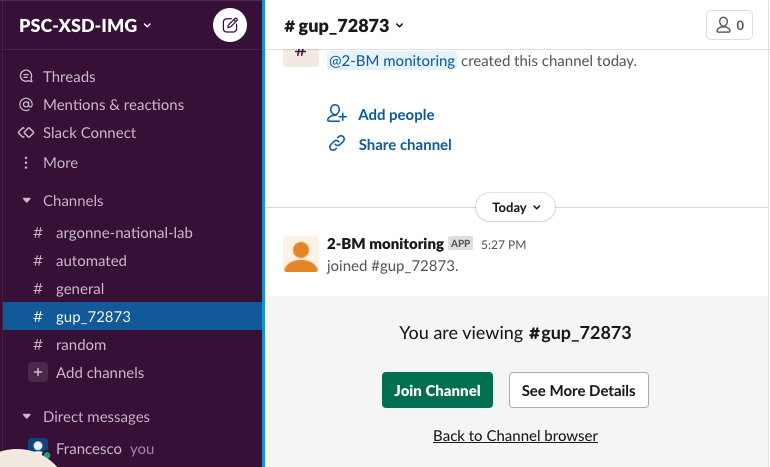
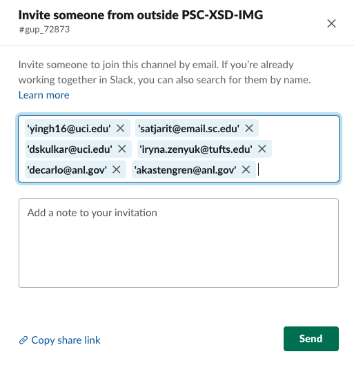

=============
APS Slack GUP
=============

Creates slack channel using General User Proposal (GUP) number (GUP-#) and invites in the channel all users listed in the proposal

Usage
=====

To see the information of the currently running experiment
::

    $ slack show
	2021-10-01 11:37:27,486 - GUP proposal_id: 72873
	2021-10-01 11:37:27,720 - Added yingh16@uci.edu to the e-mail list.
	2021-10-01 11:37:27,721 - Added satjarit@email.sc.edu to the e-mail list.
	2021-10-01 11:37:27,721 - Added dskulkar@uci.edu to the e-mail list.
	2021-10-01 11:37:27,721 - Added iryna.zenyuk@tufts.edu to the e-mail list.
	2021-10-01 11:37:27,721 - General
	2021-10-01 11:37:27,721 -   config           /home/beams/USER2BMB/slack.conf
	2021-10-01 11:37:27,721 -   verbose          True
	2021-10-01 11:37:27,721 - Settings
	2021-10-01 11:37:27,721 -   testing          0.0
	2021-10-01 11:37:27,721 - Contacts
	2021-10-01 11:37:27,721 -   primary_beamline_contact_email akastengren@anl.gov
	2021-10-01 11:37:27,721 -   secondary_beamline_contact_email decarlo@anl.gov

To create a slack channel called gup_72873 and invite all users listed in the proposal

::

    $ slack gup
    2021-10-11 17:27:29,695 - GUP proposal_id: 72873
    2021-10-11 17:27:29,895 - Added yingh16@uci.edu to the e-mail list.
    2021-10-11 17:27:29,895 - Added satjarit@email.sc.edu to the e-mail list.
    2021-10-11 17:27:29,895 - Added dskulkar@uci.edu to the e-mail list.
    2021-10-11 17:27:29,895 - Added iryna.zenyuk@tufts.edu to the e-mail list.
    2021-10-11 17:27:30,171 - Slack result {'ok': True, 'channel': {'id': 'C02HE6C538B', 'name': 'gup_72873', 'is_channel': True, 'is_group': False, 'is_im': False, 'is_mpim': False, 'is_private': False, 'created': 1633991250, 'is_archived': False, 'is_general': False, 'unlinked': 0, 'name_normalized': 'gup_72873', 'is_shared': False, 'is_org_shared': False, 'is_pending_ext_shared': False, 'pending_shared': [], 'parent_conversation': None, 'creator': 'U02FHG33693', 'is_ext_shared': False, 'shared_team_ids': ['T024R3UJBAN'], 'pending_connected_team_ids': [], 'is_member': True, 'last_read': '0000000000.000000', 'topic': {'value': '', 'creator': '', 'last_set': 0}, 'purpose': {'value': '', 'creator': '', 'last_set': 0}, 'previous_names': [], 'priority': 0}}
    2021-10-11 17:27:30,171 - Please invite to the slack channel gup_72873 these users ['yingh16@uci.edu', 'satjarit@email.sc.edu', 'dskulkar@uci.edu', 'iryna.zenyuk@tufts.edu', 'decarlo@anl.gov', 'akastengren@anl.gov']
    2021-10-11 17:27:30,171 - General
    2021-10-11 17:27:30,172 -   config           /home/beams/USER2BMB/slack.conf
    2021-10-11 17:27:30,172 -   verbose          True
    2021-10-11 17:27:30,172 - Settings
    2021-10-11 17:27:30,172 -   testing          0.0
    2021-10-11 17:27:30,172 - Contacts
    2021-10-11 17:27:30,172 -   primary_beamline_contact_email decarlo@anl.gov
    2021-10-11 17:27:30,172 -   secondary_beamline_contact_email akastengren@anl.gov

To share the newly created slack channel with the user listed in the proposal:

1. Select the newlly created channel: 

2. Share the channel with users listed in the proposal by copy/paste their email address in the invite box:

for help::

	slack -h
	usage: slack [-h] [--config FILE]  ...

	optional arguments:
	  -h, --help     show this help message and exit
	  --config FILE  File name of configuration

	Commands:
	  
	    init         Create configuration file
	    show         Show user and experiment info from the APS schedule
	    gup          Create a slack channel using the current GUP# and share it with all users listed in the proposal

::

	slack gup -h
	usage: slack gup [-h] [--testing TESTING] [--primary-beamline-contact-email FILE] [--secondary-beamline-contact-email FILE]
	                 [--config FILE] [--verbose]

	optional arguments:
	  -h, --help            show this help message and exit
	  --testing TESTING     Number of +/- number days for the current date. Used for testing (default: 0)
	  --primary-beamline-contact-email FILE
	                        Beamline scientist email (default: decarlo@anl.gov)
	  --secondary-beamline-contact-email FILE
	                        Beamline scientist email (default: akastengren@anl.gov)
	  --config FILE         File name of configuration (default: /home/beams/USER2BMB/slack.conf)
	  --verbose             Verbose output (default: True)

Installation
============

Pre-requisites
--------------

Read the `Getting started with Bolt for Python <https://slack.dev/bolt-python/tutorial/getting-started>`_  guide and `create a Slack app <https://api.slack.com/apps/new>`_ 

.. image:: docs/source/img/create_app.png
    :width: 45%
    :align: center

Select **From scratch** and follow the on-screen instructions.

Mode
----

Select **Socket Mode** 

.. image:: docs/source/img/socket_mode_01.png
    :width: 15%
    :align: center

.. image:: docs/source/img/socket_mode_02.png
    :width: 45%
    :align: center

- Enable Socket Mode 
- Choose Token Name (e.g. MyToken)  
- Click “Generate” 

.. warning:: It is important to treat the **OAuth Token** as a password and never include it in your code. One option is to set it as and environment variable. To do this, copy token xapp-1- in a file in your user home directory e.g.::

    ~/.slackenv

as APP_TOKEN=xapp-1-........

Features and functionalities
----------------------------

Add features and functionalities (enable all those that are green)

.. image:: docs/source/img/features_functionalities.png
    :width: 40%
    :align: center

- Incoming webhooks (this allows your bot to post messages and files in the chat; note that the green check mark on the screen shot above does not appear right away, but at some point later in the process)

- Event subscription; Subscribe to bot events with “Add Bot User Event”:

.. image:: docs/source/img/event_subscription.png
    :width: 45%
    :align: center

Scopes
------

Once the Slack app is created you need to set the Slack app capabilities and permissions. These are called `scopes <https://api.slack.com/scopes>`_ and can be set accessing the Bot Token Scopes under the  **OAuth&Permissions** tab at:

.. image:: docs/source/img/features.png
    :width: 15%
    :align: center

and selecting the following:

.. image:: docs/source/img/scopes.png
    :width: 45%
    :align: center

Once this is done, select the **Install to Workspace** to obtain the **Bot User OAuth Token** and copy it in::

    ~/.slackenv

as BOT_TOKEN=xoxb-........

Finally you need invite the Slack app to a specific slack channel:

.. image:: docs/source/img/invite.png
    :width: 60%
    :align: center

Installing from source
======================

In a prepared `anaconda <https://www.anaconda.com/products/individual>`_ python virtualenv or as root for system-wide installation clone  
`slackaps <https://github.com/xray-imaging/slack-aps.git>`_ from `GitHub <https://github.com>`_ repository

::

    $ git clone https://github.com/xray-imaging/slack-aps.git slack-aps
    $ cd slack-aps
    $ python setup.py install

Dependencies
============

python
------

Install the package listed in the `requirements <https://github.com/xray-imaging/slack-gup/blob/main/requirements.txt>`_ file. 

data management
---------------

To access the APS scheduing system install::

	$ conda install -c aps-anl-tag aps-dm-api='5.0.3=py39_1'

add in your .bashrc::

	export DM_APS_DB_WEB_SERVICE_URL=https://xraydtn02.xray.aps.anl.gov:11236 

To test the access to the APS scheduling system::

	python -c "from dm.aps_db_web_service.api.esafApsDbApi import EsafApsDbApi; api = EsafApsDbApi();print(api.listEsafs(sector='32', 	year=2021))"

