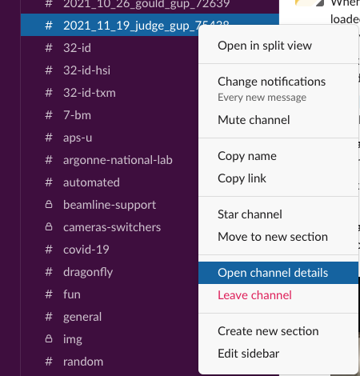
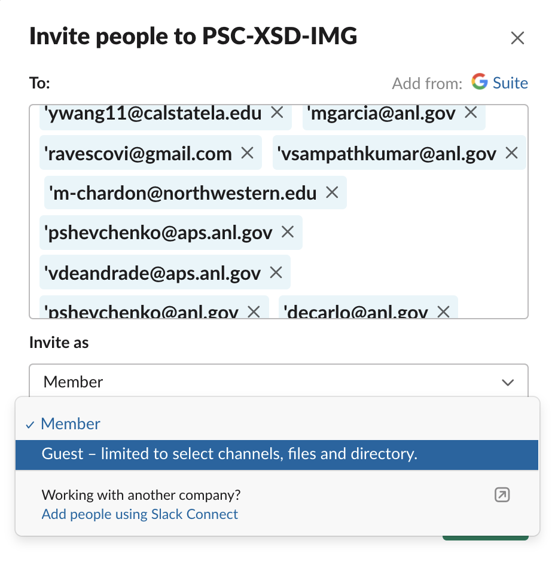
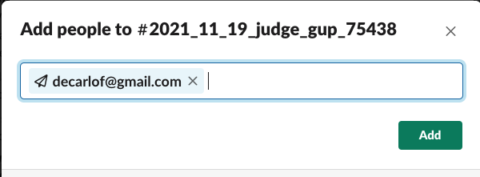
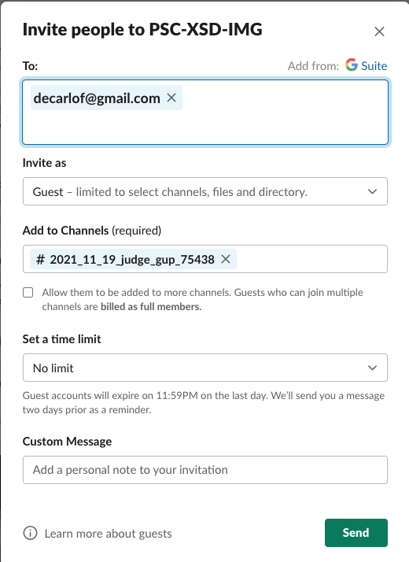

=============
APS Slack GUP
=============

Creates slack channel using General User Proposal (GUP) number (GUP-#) and invites in the channel all users listed in the proposal

Usage
=====

Create
------

To create a slack channel called 2021_10_26_steinrueck_gup_73002 and invite all users listed in the proposal

::

    $ slack gup
    2021-10-26 22:44:28,928 - Proposal starting date: 2021_10_26
    2021-10-26 22:44:29,154 - Proposal PI: steinrueck
    2021-10-26 22:44:29,550 - GUP proposal_id: 73002
    2021-10-26 22:44:29,745 - Added c.j.takacs@gmail.com to the e-mail list.
    2021-10-26 22:44:29,746 - Added caochuntian@gmail.com to the e-mail list.
    2021-10-26 22:44:29,746 - Added galluzzo.m@berkeley.edu to the e-mail list.
    2021-10-26 22:44:29,746 - Added lgrundy@berkeley.edu to the e-mail list.
    2021-10-26 22:44:29,746 - Added michael.toney@colorado.edu to the e-mail list.
    2021-10-26 22:44:29,746 - Added nbalsara@cchem.berkeley.edu to the e-mail list.
    2021-10-26 22:44:29,746 - Added hans.georg.steinrueck@uni-paderborn.de to the e-mail list.
    2021-10-26 22:44:30,000 - Created slack channel: 2021_10_26_steinrueck_gup_73002
    2021-10-26 22:44:30,001 - Please invite to the slack channel 2021_10_26_steinrueck_gup_73002 these users ['c.j.takacs@gmail.com', 'caochuntian@gmail.com', 'galluzzo.m@berkeley.edu', 'lgrundy@berkeley.edu', 'michael.toney@colorado.edu', 'nbalsara@cchem.berkeley.edu', 'hans.georg.steinrueck@uni-paderborn.de', 'decarlo@anl.gov', 'akastengren@anl.gov']
    2021-10-26 22:44:30,001 - General
    2021-10-26 22:44:30,001 -   config           /home/beams/8IDIUSER/slack.conf
    2021-10-26 22:44:30,001 -   verbose          True
    2021-10-26 22:44:30,001 - Settings
    2021-10-26 22:44:30,001 -   set              0.0
    2021-10-26 22:44:30,001 - Beamline contacts
    2021-10-26 22:44:30,001 -   primary_beamline_contact_email decarlo@anl.gov
    2021-10-26 22:44:30,001 -   secondary_beamline_contact_email akastengren@anl.gov

Share
-----

To share the newly created slack channel with the user listed in the proposal:

1. Select the newlly created channel and select **Open channel details**: 

select the **Members** tab and click **Add people**

and copy/paste the user's email address list provided by the above **slack gup** command:

then press **Add** and you will get:

Select **Your coworker** and select **Invite as guest** and get:

Press **Send** and all users will be able to access as guest their gup proposal channel.

Show
----

To see the information of the currently running experiment
::

    $ slack show
    2021-10-26 22:45:25,034 - GUP proposal_id: 73002
    2021-10-26 22:45:25,230 - Added c.j.takacs@gmail.com to the e-mail list.
    2021-10-26 22:45:25,230 - Added caochuntian@gmail.com to the e-mail list.
    2021-10-26 22:45:25,230 - Added galluzzo.m@berkeley.edu to the e-mail list.
    2021-10-26 22:45:25,230 - Added lgrundy@berkeley.edu to the e-mail list.
    2021-10-26 22:45:25,230 - Added michael.toney@colorado.edu to the e-mail list.
    2021-10-26 22:45:25,230 - Added nbalsara@cchem.berkeley.edu to the e-mail list.
    2021-10-26 22:45:25,230 - Added hans.georg.steinrueck@uni-paderborn.de to the e-mail list.
    2021-10-26 22:45:25,230 - General
    2021-10-26 22:45:25,230 -   config           /home/beams/8IDIUSER/slack.conf
    2021-10-26 22:45:25,230 -   verbose          True
    2021-10-26 22:45:25,231 - Settings
    2021-10-26 22:45:25,231 -   set              0.0
    2021-10-26 22:45:25,231 - Beamline contacts
    2021-10-26 22:45:25,231 -   primary_beamline_contact_email decarlo@anl.gov
    2021-10-26 22:45:25,231 -   secondary_beamline_contact_email akastengren@anl.gov

To create a slack channel for a future/past user group and invite all users listed in the proposal, e.g 5 days in the future:

::

    $ slack gup --set 5
    2021-10-26 22:47:22,618 - Proposal starting date: 2021_10_29
    2021-10-26 22:47:22,817 - Proposal PI: antonio
    2021-10-26 22:47:23,184 - GUP proposal_id: 76020
    2021-10-26 22:47:23,374 - Added hans.georg.steinrueck@uni-paderborn.de to the e-mail list.
    2021-10-26 22:47:23,374 - Added shrayesh@uchicago.edu to the e-mail list.
    2021-10-26 22:47:23,374 - Added michael.toney@colorado.edu to the e-mail list.
    2021-10-26 22:47:23,374 - Added pbennington@uchicago.edu to the e-mail list.
    2021-10-26 22:47:23,374 - Added emma.antonio@colorado.edu to the e-mail list.
    2021-10-26 22:47:23,374 - Added dufresne@aps.anl.gov to the e-mail list.
    2021-10-26 22:47:23,374 - Added sureshn@aps.anl.gov to the e-mail list.
    2021-10-26 22:47:23,656 - Created slack channel: 2021_10_29_antonio_gup_76020
    2021-10-26 22:47:23,656 - Please invite to the slack channel 2021_10_29_antonio_gup_76020 these users ['hans.georg.steinrueck@uni-paderborn.de', 'shrayesh@uchicago.edu', 'michael.toney@colorado.edu', 'pbennington@uchicago.edu', 'emma.antonio@colorado.edu', 'dufresne@aps.anl.gov', 'sureshn@aps.anl.gov', 'decarlo@anl.gov', 'akastengren@anl.gov']
    2021-10-26 22:47:23,656 - General
    2021-10-26 22:47:23,656 -   config           /home/beams/8IDIUSER/slack.conf
    2021-10-26 22:47:23,657 -   verbose          True
    2021-10-26 22:47:23,657 - Settings
    2021-10-26 22:47:23,657 -   set              5.0
    2021-10-26 22:47:23,657 - Beamline contacts
    2021-10-26 22:47:23,657 -   primary_beamline_contact_email decarlo@anl.gov
    2021-10-26 22:47:23,657 -   secondary_beamline_contact_email akastengren@anl.gov

Help
----

::

    slack -h
    usage: slack [-h] [--config FILE]  ...

    optional arguments:
      -h, --help     show this help message and exit
      --config FILE  File name of configuration

    Commands:
      
        init         Create configuration file
        show         Show user and experiment info from the APS schedule
        gup          Create a slack channel using called YYYY_MM_DD_PI-last-name_gup_##### and share it with all users listed in the proposal

::

    slack gup -h
    usage: slack gup [-h] [--beamline {None,2_bm,7_bm,8_id_i,20_bm,29_id,32_id_b,32_id_c}] [--set SET]
                   [--primary-beamline-contact-email FILE] [--secondary-beamline-contact-email FILE] [--config FILE]
                   [--verbose]

    optional arguments:
      -h, --help            show this help message and exit
      --beamline {None,2_bm,7_bm,8_id_i,20_bm,29_id,32_id_b,32_id_c}
                            When set adds the beamline name as a prefix to the slack channel name (default: None)
      --set SET             Number of +/- number days for the current date. Used for setting a channel for past/future user
                            groups (default: 0)
      --primary-beamline-contact-email FILE
                            Beamline scientist email (default: pshevchenko@anl.gov)
      --secondary-beamline-contact-email FILE
                            Beamline scientist email (default: decarlo@anl.gov)
      --config FILE         File name of configuration (default: /home/beams/USERTXM/slack.conf)
      --verbose             Verbose output (default: True)

Installation
============

Pre-requisites
--------------

Read the `Getting started with Bolt for Python <https://slack.dev/bolt-python/tutorial/getting-started>`_  guide and `create a Slack app <https://api.slack.com/apps/new>`_ 

.. image:: docs/source/img/create_app.png
    :width: 45%
    :align: center

Select **From scratch** and follow the on-screen instructions.

Mode
----

Select **Socket Mode** 

.. image:: docs/source/img/socket_mode_01.png
    :width: 15%
    :align: center

.. image:: docs/source/img/socket_mode_02.png
    :width: 45%
    :align: center

- Enable Socket Mode 
- Choose Token Name (e.g. MyToken)  
- Click “Generate” 

.. warning:: It is important to treat the **OAuth Token** as a password and never include it in your code. One option is to set it as and environment variable. To do this, copy token xapp-1- in a file in your user home directory e.g.::

    ~/.slackenv

as APP_TOKEN=xapp-1-........

Features and functionalities
----------------------------

Add features and functionalities (enable all those that are green)

.. image:: docs/source/img/features_functionalities.png
    :width: 40%
    :align: center

- Incoming webhooks (this allows your bot to post messages and files in the chat; note that the green check mark on the screen shot above does not appear right away, but at some point later in the process)

- Event subscription; Subscribe to bot events with “Add Bot User Event”:

.. image:: docs/source/img/event_subscription.png
    :width: 45%
    :align: center

Scopes
------

Once the Slack app is created you need to set the Slack app capabilities and permissions. These are called `scopes <https://api.slack.com/scopes>`_ and can be set accessing the Bot Token Scopes under the  **OAuth&Permissions** tab at:

.. image:: docs/source/img/features.png
    :width: 15%
    :align: center

and selecting the following:

.. image:: docs/source/img/scopes.png
    :width: 45%
    :align: center

Once this is done, select the **Install to Workspace** to obtain the **Bot User OAuth Token** and copy it in::

    ~/.slackenv

as BOT_TOKEN=xoxb-........

Finally you need invite the Slack app to a specific slack channel:

.. image:: docs/source/img/invite.png
    :width: 60%
    :align: center

Installing from source
======================

In a prepared `anaconda <https://www.anaconda.com/products/individual>`_ python virtualenv or as root for system-wide installation clone  
`slackaps <https://github.com/xray-imaging/slack-aps.git>`_ from `GitHub <https://github.com>`_ repository

::

    $ git clone https://github.com/xray-imaging/slack-aps.git slack-aps
    $ cd slack-aps
    $ python setup.py install

Dependencies
============

python
------

Install the package listed in the `requirements <https://github.com/xray-imaging/slack-gup/blob/main/requirements.txt>`_ file. 

data management
---------------

To access the APS scheduing system install::

    $ conda install -c aps-anl-tag aps-dm-api='5.0.3=py39_1'

add in your .bashrc::

    DM_APS_DB_WEB_SERVICE_URL=https://xraydtn02.xray.aps.anl.gov:11236
    export DM_APS_DB_WEB_SERVICE_URL
    DM_BEAMLINE_NAME=20-BM-B
    export DM_BEAMLINE_NAME

Replace DM_BEAMLINE_NAME with your beamline name as listed in the `APS beamline directory <https://www.aps.anl.gov/Beamlines/Directory>`_. 

To test the access to the APS scheduling system::

    python -c "from dm.aps_db_web_service.api.esafApsDbApi import EsafApsDbApi; api = EsafApsDbApi();print(api.listEsafs(sector='20',     year=2021))"

