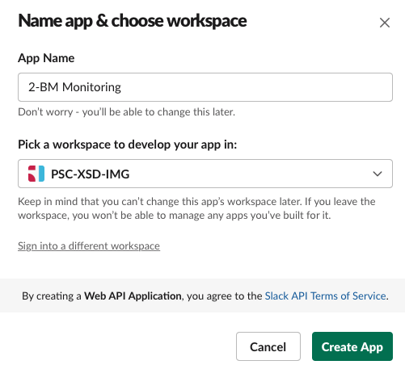
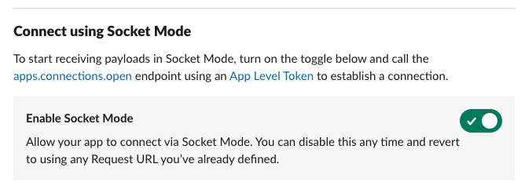
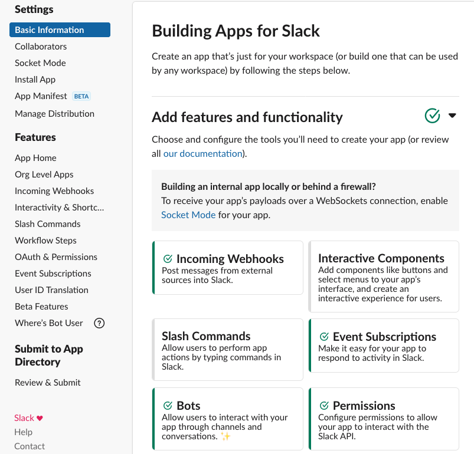
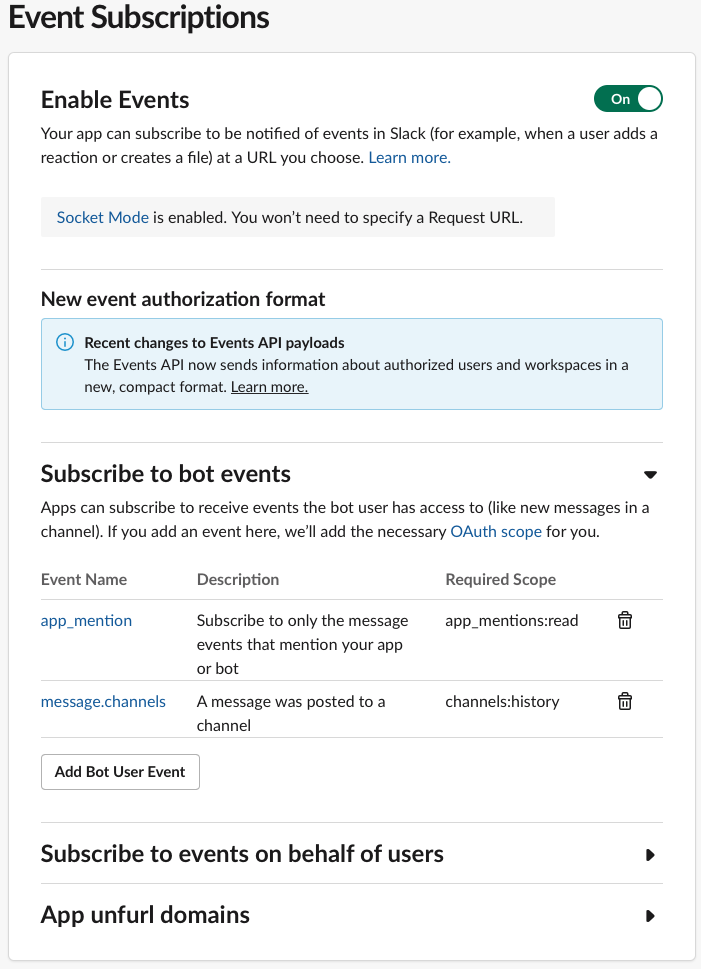
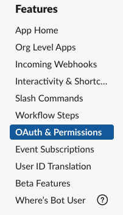
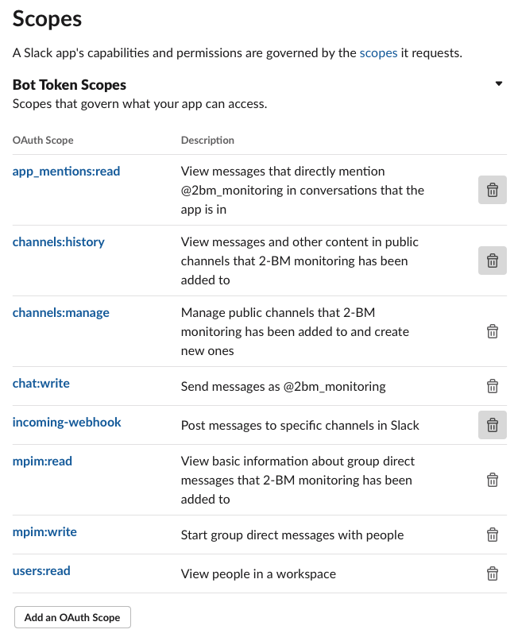
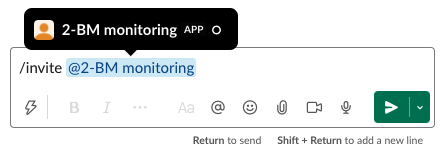

=============
APS Slack GUP
=============

Creates slack channel using General User Proposal (GUP) number (GUP-#) and invites in the channel all users listed in the proposal

Usage
=====

To see the information of the currently running experiment
::

    $ slack show
	2021-10-01 11:37:27,486 - GUP proposal_id: 72873
	2021-10-01 11:37:27,720 - Added yingh16@uci.edu to the e-mail list.
	2021-10-01 11:37:27,721 - Added satjarit@email.sc.edu to the e-mail list.
	2021-10-01 11:37:27,721 - Added dskulkar@uci.edu to the e-mail list.
	2021-10-01 11:37:27,721 - Added iryna.zenyuk@tufts.edu to the e-mail list.
	2021-10-01 11:37:27,721 - General
	2021-10-01 11:37:27,721 -   config           /home/beams/USER2BMB/slack.conf
	2021-10-01 11:37:27,721 -   verbose          True
	2021-10-01 11:37:27,721 - Settings
	2021-10-01 11:37:27,721 -   testing          0.0
	2021-10-01 11:37:27,721 - Contacts
	2021-10-01 11:37:27,721 -   primary_beamline_contact_email akastengren@anl.gov
	2021-10-01 11:37:27,721 -   secondary_beamline_contact_email decarlo@anl.gov

To create a slack channel called gup_72873 and invite all users listed in the proposal

::

    $ slack gup
	2021-10-01 11:34:07,402 - GUP proposal_id: 72873
	2021-10-01 11:34:07,614 - Added yingh16@uci.edu to the e-mail list.
	2021-10-01 11:34:07,614 - Added satjarit@email.sc.edu to the e-mail list.
	2021-10-01 11:34:07,614 - Added dskulkar@uci.edu to the e-mail list.
	2021-10-01 11:34:07,614 - Added iryna.zenyuk@tufts.edu to the e-mail list.
	gup_72873
	2021-10-01 11:34:07,922 - Slack result {'ok': True, 'channel': {'id': 'C02H2TKMEV6', 'name': 	'gup_72873', 'is_channel': True, 'is_group': False, 'is_im': False, 'created': 1633106047, 	'is_archived': False, 'is_general': False, 'unlinked': 0, 'name_normalized': 'gup_72873', 'is_shared': 	False, 'parent_conversation': None, 'creator': 'U02FHG33693', 'is_ext_shared': False, 'is_org_shared': 	False, 'shared_team_ids': ['T024R3UJBAN'], 'pending_shared': [], 'pending_connected_team_ids': [], 	'is_pending_ext_shared': False, 'is_member': True, 'is_private': False, 'is_mpim': False, 'last_read': 	'0000000000.000000', 'topic': {'value': '', 'creator': '', 'last_set': 0}, 'purpose': {'value': '', 	'creator': '', 'last_set': 0}, 'previous_names': [], 'priority': 0}}
	2021-10-01 11:34:07,922 - General
	2021-10-01 11:34:07,922 -   config           /home/beams/USER2BMB/slack.conf
	2021-10-01 11:34:07,922 -   verbose          True
	2021-10-01 11:34:07,923 - Settings
	2021-10-01 11:34:07,923 -   testing          0.0
	2021-10-01 11:34:07,923 - Contacts
	2021-10-01 11:34:07,923 -   primary_beamline_contact_email akastengren@anl.gov
	2021-10-01 11:34:07,923 -   secondary_beamline_contact_email decarlo@anl.gov

Installation
============

Pre-requisites
--------------

Read the `Getting started with Bolt for Python <https://slack.dev/bolt-python/tutorial/getting-started>`_  guide and `create a Slack app <https://api.slack.com/apps/new>`_ 

Select **From scratch** and follow the on-screen instructions.

Mode
----

Select **Socket Mode** 

.. image:: docs/source/img/socket_mode_01.png
    :width: 15%
    :align: center

- Enable Socket Mode 
- Choose Token Name (e.g. MyToken)  
- Click “Generate” 

.. warning:: It is important to treat the **OAuth Token** as a password and never include it in your code. One option is to set it as and environment variable. To do this, copy token xapp-1- in a file in your user home directory e.g.::

    ~/.slackenv

as APP_TOKEN=xapp-1-........

Features and functionalities
----------------------------

Add features and functionalities (enable all those that are green)

- Incoming webhooks (this allows your bot to post messages and files in the chat; note that the green check mark on the screen shot above does not appear right away, but at some point later in the process)

- Event subscription; Subscribe to bot events with “Add Bot User Event”:

Scopes
------

Once the Slack app is created you need to set the Slack app capabilities and permissions. These are called `scopes <https://api.slack.com/scopes>`_ and can be set accessing the Bot Token Scopes under the  **OAuth&Permissions** tab at:

and selecting the following:

Once this is done, select the **Install to Workspace** to obtain the **Bot User OAuth Token** and copy it in::

    ~/.slackenv

as BOT_TOKEN=xoxb-........

Finally you need invite the Slack app to a specific slack channel:

Installing from source
======================

In a prepared virtualenv or as root for system-wide installation clone the 
`slackaps <https://github.com/xray-imaging/slack-aps.git>`_ from `GitHub <https://github.com>`_ repository

::

    $ git clone https://github.com/xray-imaging/slack-aps.git slack-aps

Dependencies
============

Install the following package::

    $ pip ...
